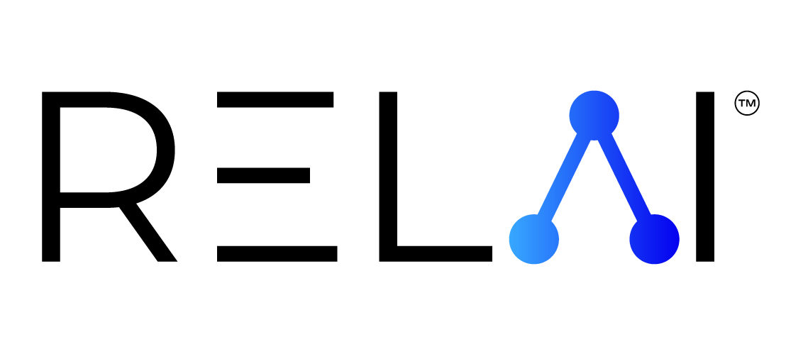

<p align="center">
  
</p>
<p align="left">
<h1 align="center">Simulate → Evaluate → Optimize AI Agents</h1>
<p align="center">
  <a href="https://pypi.org/project/relai/"></a>
  
  <a href="LICENSE.md"></a>
  <a href="http://docs.relai.ai"></a>
  <a href="https://github.com/relai-ai/relai-sdk/actions/workflows/upload-to-package-index.yml"></a>
</p>


**RELAI** is a platform for building **reliable AI agents**. It streamlines the hardest parts of agent development—**simulation**, **evaluation**, and **optimization**—so you can iterate quickly with confidence.

**What you get**
- **Agent Simulation** — Create full/partial environments, define LLM personas, mock MCP servers & tools, and generate synthetic data. Optionally condition simulation on real samples to better match production.
- **Agent Evaluation** — Mix code-based and LLM-based custom evaluators or use RELAI platform evaluators. Turn human reviews into benchmarks you can re-run.
- **Agent Optimization (Maestro)** — Holistic optimizer that uses evaluator signals & feedback to improve **prompts/configs** and suggest **graph-level** changes. Maestro selects best model/tool/graph based on observed performance.

**Works with**: **OpenAI Agents SDK**, **Google ADK**, **LangGraph**, and other agent frameworks.

## Quickstart

Create a free account and get a RELAI API key: [platform.relai.ai/settings/access/api-keys](https://platform.relai.ai/settings/access/api-keys)

### Installation and Setup

```bash
pip install relai
# or
uv add relai

export RELAI_API_KEY="<RELAI_API_KEY>"
```

### Example: A simple Stock Assistant Agent (Simulate → Evaluate → Optimize) 

Notebook version of the example below: [stock-assistant (simulate->evaluate->optimize).ipynb](/notebooks/basic/stock-assistant%20(simulate-%3Eevaluate-%3Eoptimize).ipynb)


Prerequisites: Needs an OpenAI API key and `openai-agents` installed to run the base agent.
To use Maestro graph optimizer, save the following in a file called `stock-assistant.py` (or change the `code_paths` argument to `maestro.optimize_structure`).
```python
# ============================================================================
# STEP 0 — Prerequisites
# ============================================================================
# export OPENAI_API_KEY="sk-..."
# `uv add openai-agents`
# export RELAI_API_KEY="relai-..."
# Save as `stock-assistant.py`

import asyncio

from agents import Agent, Runner

from relai import (
    AgentOutputs,
    AsyncRELAI,
    AsyncSimulator,
    SimulationTape,
    random_env_generator,
)
from relai.critico import Critico
from relai.critico.evaluate import RELAIFormatEvaluator
from relai.maestro import Maestro, params, register_param
from relai.mocker import Persona
from relai.simulator import simulated

# ============================================================================
# STEP 1.1 — Decorate inputs/tools that will be simulated
# ============================================================================


@simulated
async def get_user_query() -> str:
    """Get user's query about stock prices."""
    # In a real agent, this function might get input from a chat interface.
    return input("Enter you stock query: ")


# ============================================================================
# STEP 1.2 — Register parameters for optimization
# ============================================================================

register_param(
    "prompt",
    type="prompt",
    init_value="You are a helpful assistant for stock price questions.",
    desc="system prompt for the agent",
)

# ============================================================================
# STEP 2 — Your agent core
# ============================================================================


async def agent_fn(tape: SimulationTape) -> AgentOutputs:
    # It is good practice to catch exceptions in agent function
    # especially if the agent might raise errors with different configs
    try:
        question = await get_user_query()
        agent = Agent(
            name="Stock assistant",
            instructions=params.prompt,  # access registered parameter
            model="gpt-5-mini",
        )
        result = await Runner.run(agent, question)
        tape.extras["format_rubrics"] = {"Prices must include cents (eg: $XXX.XX)": 1.0}
        tape.agent_inputs["question"] = question  # trace inputs for later auditing
        return {"summary": result.final_output}
    except Exception as e:
        return {"summary": str(e)}
    


async def main() -> None:
    # Set up your simulation environment
    # Bind Personas/MockTools to fully-qualified function names
    env_generator = random_env_generator(
        config_set={
            "__main__.get_user_query": [Persona(user_persona="A polite and curious user.")],
        }
    )

    async with AsyncRELAI() as client:
        # ============================================================================
        # STEP 3 — Simulate
        # ============================================================================
        simulator = AsyncSimulator(agent_fn=agent_fn, env_generator=env_generator, client=client)
        agent_logs = await simulator.run(num_runs=1)

        # ============================================================================
        # STEP 4 — Evaluate with Critico
        # ============================================================================
        critico = Critico(client=client)
        format_evaluator = RELAIFormatEvaluator(client=client)
        critico.add_evaluators({format_evaluator: 1.0})
        critico_logs = await critico.evaluate(agent_logs)

        # Publish evaluation report to the RELAI platform
        await critico.report(critico_logs)

        maestro = Maestro(client=client, agent_fn=agent_fn, log_to_platform=True, name="Stock assistant")
        maestro.add_setup(simulator=simulator, critico=critico)

        # ============================================================================
        # STEP 5.1 — Optimize configs with Maestro (the parameters registered earlier in STEP 2)
        # ============================================================================

        # params.load("saved_config.json")  # load previous params if available
        await maestro.optimize_config(
            total_rollouts=20,  # Total number of rollouts to use for optimization.
            batch_size=2,  # Base batch size to use for individual optimization steps. Defaults to 4.
            explore_radius=1,  # A positive integer controlling the aggressiveness of exploration during optimization.
            explore_factor=0.5,  # A float between 0 to 1 controlling the exploration-exploitation trade-off.
            verbose=True,  # If True, additional information will be printed during the optimization step.
        )
        params.save("saved_config.json")  # save optimized params for future usage

        # ============================================================================
        # STEP 5.2 — Optimize agent structure with Maestro (changes that cannot be achieved by setting parameters alone)
        # ============================================================================

        await maestro.optimize_structure(
            total_rollouts=10,  # Total number of rollouts to use for optimization.
            code_paths=["stock-assistant.py"],  # A list of paths corresponding to code implementations of the agent.
            verbose=True,  # If True, additional information will be printed during the optimization step.
        )


if __name__ == "__main__":
    asyncio.run(main())

```
## Simulation
Create controlled environments where agents interact and generate traces. Compose LLM personas, mock MCP tools/servers, and synthetic data; optionally condition on real events to align simulation ⇄ production.

➡️ Learn more: [Simulator](https://docs.relai.ai/api/simulator.html)

## Evaluation (Critico)
Use code-based or LLM-based evaluators—or RELAI platform evaluators—and convert human reviews into benchmarks you can re-run in Simuation/CI pipeline.

➡️ Learn more: [Evaluator](https://docs.relai.ai/api/evaluator.html)

## Optimization (Maestro)
Maestro is a holistic agent optimizer. It consumes evaluator/user feedback to improve prompts, configs, and even graph structure when prompt tuning isn’t enough. It can also select the best model, best tool, and best graph based on observed performance.

➡️ Learn more: [Maestro](https://docs.relai.ai/api/maestro.html)

## Links

- 📘 **Documentation:** [docs.relai.ai](http://docs.relai.ai)
- 🧪 **Examples:** [relai-sdk/examples](examples)
- 📓 **Notebooks:** [relai-sdk/notebooks](notebooks)
- 📖 **Tutorials:** [docs.relai.ai/tutorials/index.html](https://docs.relai.ai/tutorials/index.html)
- 🌐 **Website:** [relai.ai](https://relai.ai)
- 📰 **Maestro Technical Report:** [ArXiV](https://arxiv.org/abs/2509.04642)
- 🌐 **Join the Community:** [Discord](https://discord.gg/sjaHJ34YYE)

## License

Apache 2.0

## Citation
If you use the SDK in your research, please consider citing our work:

```
@misc{relai_sdk,
  author       = {RELAI, Inc.,},
  title        = {relai-sdk},
  year         = {2025},
  howpublished = {\url{https://github.com/relai-ai/relai-sdk}},
  note         = {GitHub repository},
  urldate      = {2025-10-20}
}

@misc{wang2025maestrojointgraph,
  title={Maestro: Joint Graph & Config Optimization for Reliable AI Agents}, 
  author={Wenxiao Wang and Priyatham Kattakinda and Soheil Feizi},
  year={2025},
  eprint={2509.04642},
  archivePrefix={arXiv},
  primaryClass={cs.AI},
  url={https://arxiv.org/abs/2509.04642}, 
}
```

<p align="center"> <sub>Made with ❤️ by the RELAI team — <a href="https://relai.ai">relai.ai</a> • <a href="https://discord.gg/sjaHJ34YYE">Community</a></sub> </p>

