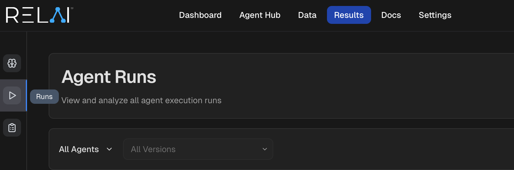
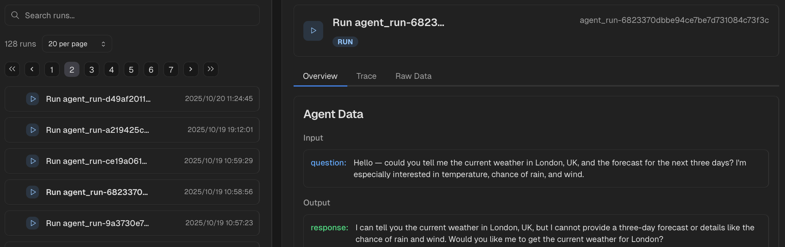
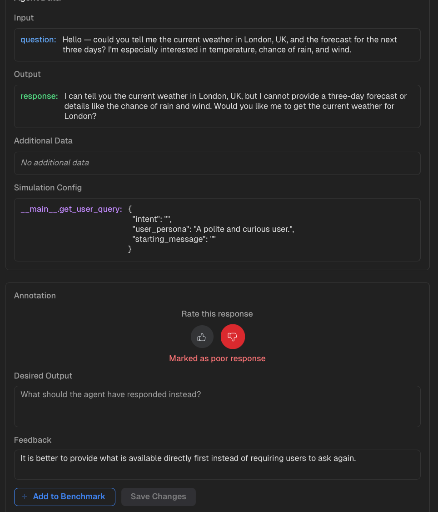
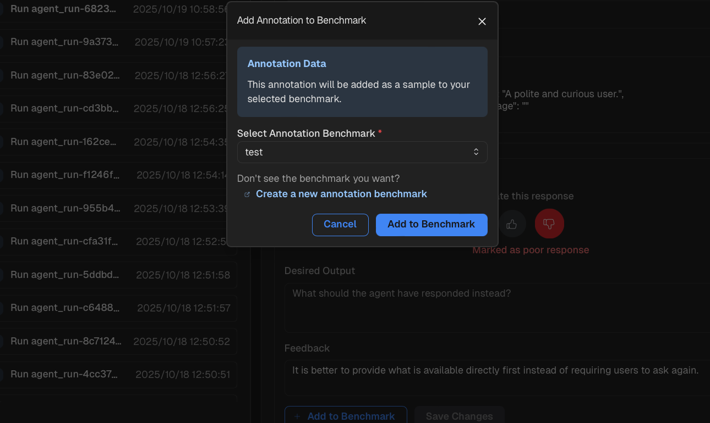

<h1>Agent Annotation Benchmark</h1>

Annotation benchmarks are benchmarks created by annotating (providing feedback to) runs of agents. 
They can be used directly in agent optimization (configs, structure). 
For a detailed example of how to run agents in a simulated environment and 
how to use annotation benchmarks in agent optimization, see [simulate->annotate->optimze](/examples/basic/simulate->annotate->optimize/).

<h2>Create Annotation Benchmark</h2>

1. To create an annotation benchmark, first go to RELAI platform and find [Run](https://platform.relai.ai/results/run) under Results.

    Results->Run"/>

2. Click on individual runs to inspect any agent you executed in a simulated environment.

    

3. Annotate the runs with the `Like/Dislike`, `Desired Output`, `Feedback` fields and save your changes.

    

4. Use the "Add to Benchmark" button at the bottom to add the annotated run as a sample to the benchmark of your choice. 
(Use the `Create a new annoatation benchmark` function if you have not created any benchmark yet)

    

5. Continue to annotate and add other runs to the benchmark. The benchmark is already ready-to-use with its benchmark id. See [simulate->annotate->optimze](/examples/basic/simulate->annotate->optimize/) for how to use annotation benchmarks in 
agent optimization.