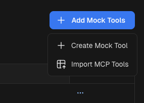
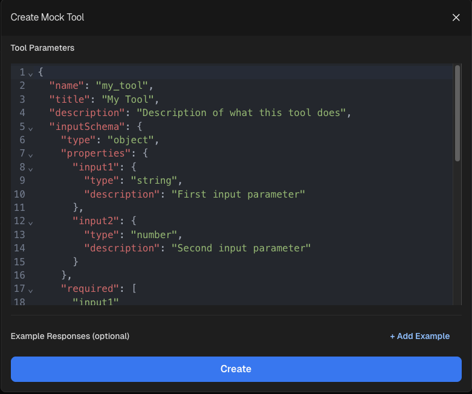
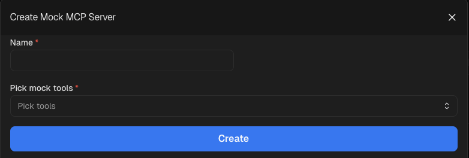
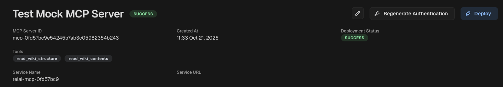

<h1>Mock MCP Server</h1>

You can use a mock MCP server to mimic a real MCP server. Mock MCP servers are useful during agent development, simulation and testing.

<h2>Create Mock Server</h2>

1. First add the tools you want to mock on the [Mock Tools](https://platform.relai.ai/agent-hub/tool) page:

    AgentHub->Mock Tools"/>

2. You can either enter the input/output schema manually or import that information directly from an existing MCP server

    AgentHub->Mock Tools->Create Mock Tool"/>

3. Once the tools you want to mock are added, you pick the tools you want to include for mocking and can create a [Mock MCP Server](https://platform.relai.ai/agent-hub/mcp-server):

    AgentHub->Mock MCP Server"/>

4. You can deploy the server by clicking on the new Mock MCP server entry and then on "Deploy"

    AgentHub->Mock MCP Server->Deploy"/>

5. You can use this mock MCP server anywhere you use a real MCP server (with agents, LLM tool call etc.,).