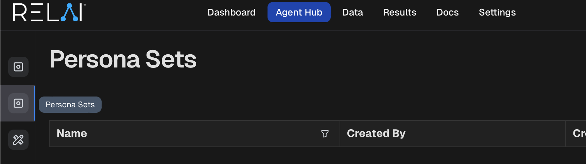
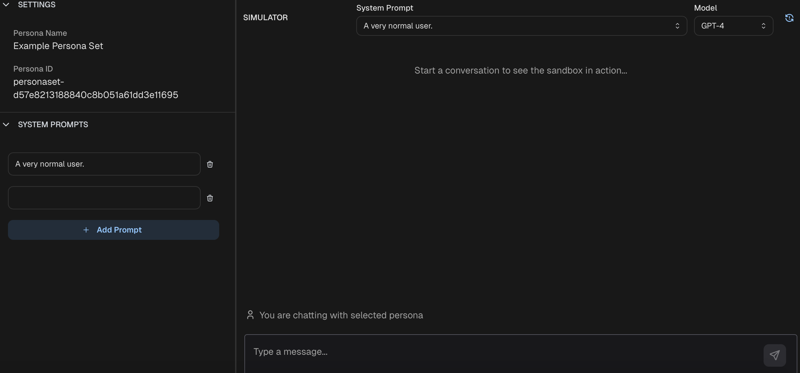

<h1>Persona Set</h1>

An AI persona can be used to mimic a particular role by defining a system prompt and optionally equipping it with tools. 
A persona set is set of personas, which can be conveniently curated and/or imported through RELAI platform.

<h2>Create Persona Set</h2>

<h3>1. To create a persona set, first go to RELAI platform and find [Persona Sets](https://platform.relai.ai/agent-hub/persona) under AgentHub.</h3>  
AgentHub->Persona Sets" width="460px"/>

<h3>2. Click "Create Persona Set".</h3>  


<h3>3. Name the new persona set; Upload a CSV file with a `system_prompts` column to populate the list, or add prompts manually.</h3>  


<h3>4. And done! Your persona set is created. You can chat with personas directly here and adjust them further whenever needed.</h3>  


<h2>Use Persona Set in Simulation</h2>

<h3>1. Decorate inputs/tools that will be simulated.</h3>

```python
from relai import simulated

@simulated
async def get_user_input():
    msg = input("User: ")
    return msg
```

<h3>2. When setting up the simulation environment, bind the persona set to the corresponding fully-qualified function names.</h3>
```python
from relai.simulator import AsyncSimulator, random_env_generator

env_generator = random_env_generator(
    {"__main__.get_user_input": PersonaSet(persona_set_id="your_persona_set_id_here")}
)

async def main():
    async with AsyncRELAI() as client:
        simulator = AsyncSimulator(
            client=client,
            agent_fn=<your agent function here>, 
            env_generator=env_generator,
            log_runs=True,
        )

        agent_logs = await simulator.run(num_runs=4)
        print(agent_logs)

asyncio.run(main())
```

